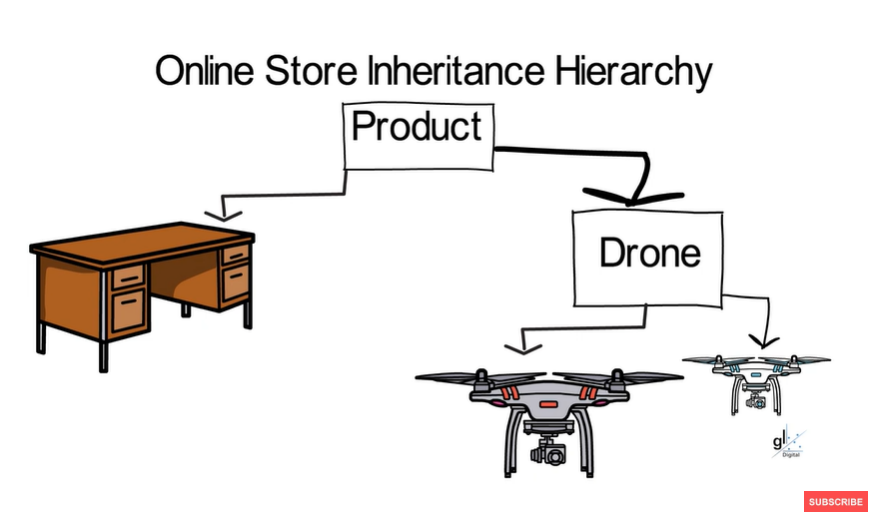

Following C# OOP tutorial from Gavin Lon 
Link: https://www.youtube.com/playlist?list=PL4LFuHwItvKYD0e60jNOtT6mFKqFMH1u_

# OfficeBuildingAutomation

Project related to this tutorial
- Project OfficeBuildingAutomation("Entry program")
- Project OfficeBuildingAutomationAPI

# Online Store Demo
Project related to this tutorial
- CSharpInheritanceExample

Online Store Inheritance Hierarchy picture(Screeenshot from the video: [link](https://youtu.be/KvUdCkUHMY4?si=lByQ-6FEFLNFn1ib&t=994))

  

